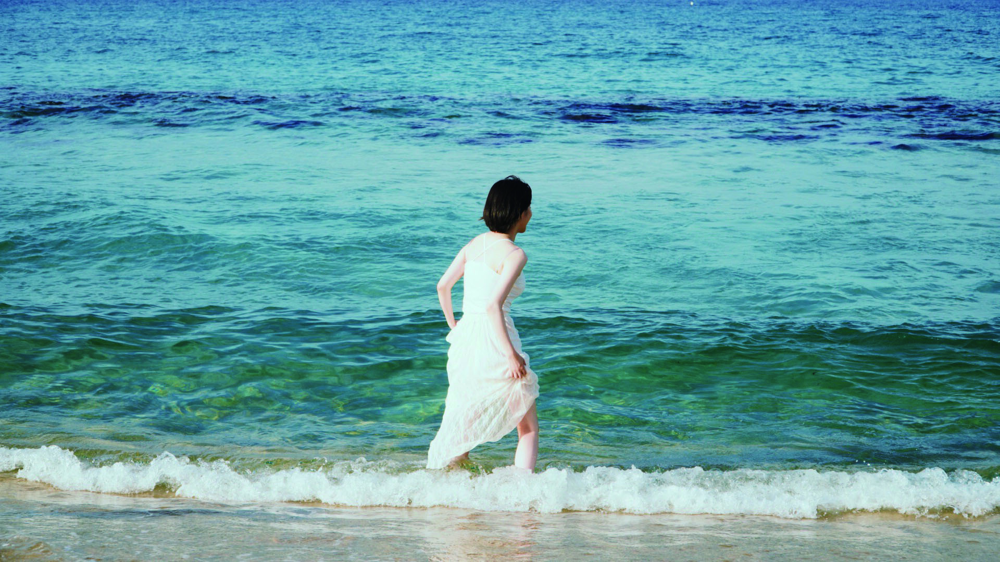
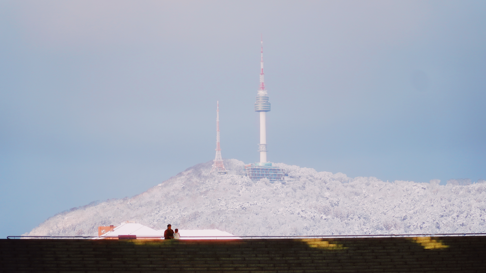
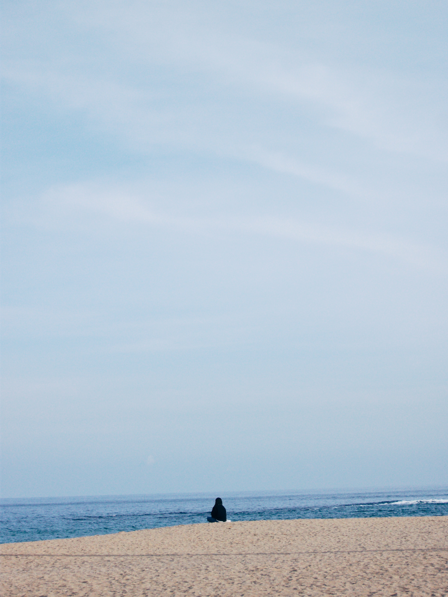
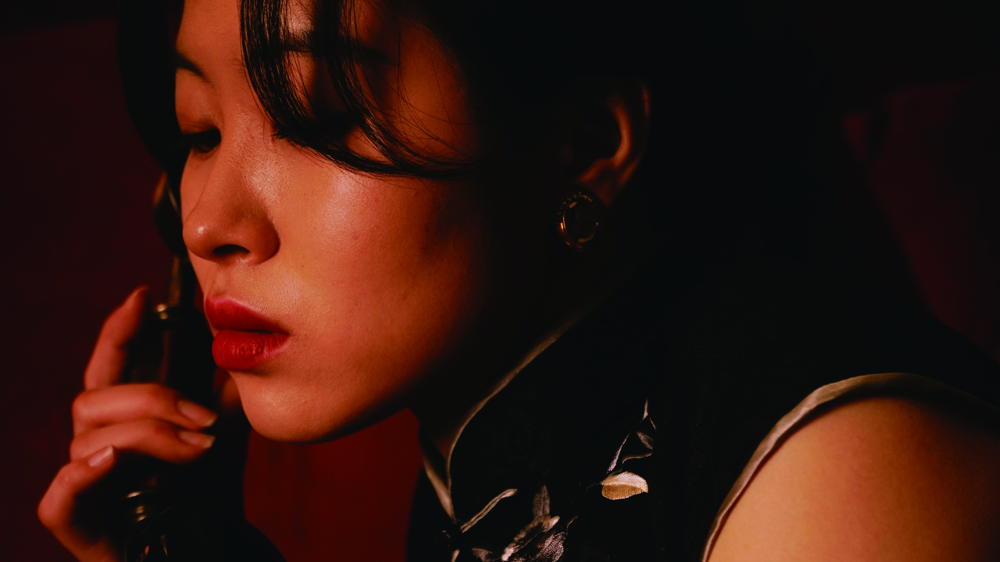

# 白霜 Baek-Sang Portfolio

> 순수 HTML, CSS, JavaScript로 구현된 미니멀 포토그래피 포트폴리오



## 📸 프로젝트 소개

백상(白霜)은 서울을 기반으로 활동하는 포토저널리스트의 포트폴리오 웹사이트입니다. 
순수 바닐라 JavaScript와 CSS로 제작되어 빠르고 가볍게 작동합니다.

### 주요 특징

- ✨ **순수 HTML/CSS/JS** - 프레임워크 없이 최적화된 성능
- 📱 **완벽한 반응형** - 모바일, 태블릿, 데스크톱 지원
- 🎨 **우아한 디자인** - 미니멀하고 전문적인 레이아웃
- 🖼️ **Masonry 갤러리** - 아름다운 이미지 배치
- ⚡ **빠른 로딩** - 최적화된 이미지와 코드
- 🎭 **부드러운 애니메이션** - 모던한 인터랙션

---

## 🌆 Street Photography Collection

### Featured Works

<div align="center">






</div>

도시의 일상 속에서 발견한 특별한 순간들. 
거리는 끊임없이 변화하는 살아있는 무대이며, 매 순간이 새로운 이야기를 만들어냅니다.

---

## 📰 Reportage

<div align="center">

</div>

현장에서 마주한 순간의 진실. 다큐멘터리적 시선으로 기록한 우리 시대의 이야기입니다.

**Gallery includes:**
- 8개의 르포르타주 이미지
- 현장의 온도와 감정을 담은 작품들

---

## 👤 Portrait Collection

<div align="center">




</div>

인물의 내면을 포착하는 순간. 빛과 그림자가 만들어내는 깊이 있는 표현.

---

## 🚀 시작하기

### 설치 방법

1. **파일 다운로드**
```bash
git clone [repository-url]
cd BS
```

2. **브라우저에서 실행**
```bash
# 간단히 index.html을 브라우저에서 열기
open index.html

# 또는 로컬 서버 실행
python -m http.server 8000
# http://localhost:8000 접속
```

### 필요 사항

- 모던 웹 브라우저 (Chrome, Firefox, Safari, Edge)
- 로컬 서버 (선택사항, 이미지 로딩을 위해 권장)

---

## 📁 프로젝트 구조

```
BS/
├── index.html          # 메인 HTML 파일
├── style.css           # 모든 스타일시트
├── script.js           # JavaScript 로직
├── README.md           # 프로젝트 문서
└── asset/
    ├── Street/         # 스트리트 포토그래피 (8장)
    │   ├── 1.jpg
    │   ├── 2.jpg
    │   ├── 3.jpg
    │   ├── 4.JPG
    │   ├── 5.JPG
    │   ├── 6.JPG
    │   ├── 7.JPG
    │   └── 8.JPG
    ├── Portrait/       # 인물 사진 (9장)
    │   ├── 1.jpg
    │   ├── 2.jpg
    │   ├── 3.jpg
    │   ├── 4.JPG
    │   ├── 5.JPG
    │   ├── 6.JPG
    │   ├── 7.jpg
    │   ├── 8.jpg
    │   └── 10.JPG
    └── Reportage/      # 르포르타주 (8장)
        ├── 1.jpg
        ├── 2.jpg
        ├── 3.jpg
        ├── 4.jpg
        ├── 5.jpg
        ├── 6.jpg
        ├── 7.jpg
        └── 8.jpg
```

---

## ✨ 주요 기능

### 1. 네비게이션
- **Work** - 전체 포트폴리오 갤러리
- **About** - 작가 소개 및 경력
- **Contact** - 연락처 및 문의 폼

### 2. 갤러리
- 🎯 Masonry 레이아웃으로 최적화된 이미지 배치
- 🎨 Grayscale 필터 + Hover 시 컬러 전환
- 📱 반응형 (모바일: 1열 / 태블릿: 2열 / 데스크톱: 3열)
- ⏱️ 순차적인 Fade-in 애니메이션

### 3. 모달 상세보기
- 🖼️ 고해상도 이미지 뷰어
- ⬅️➡️ 이전/다음 네비게이션
- ⌨️ 키보드 단축키 지원 (ESC, ←, →)
- 📑 작품 설명 및 메타데이터
- 🎭 관련 작품 추천

### 4. 애니메이션
- Fade In Up - 페이지 전환 시
- Smooth Transitions - 모든 상태 변화
- Hover Effects - 인터랙티브 요소

---

## 🎨 디자인 철학

### 미니멀리즘
> "빛은 늘 깨진 틈으로 들어오고, 가장 어두운 곳에서 밝게 빛난다"

- 불필요한 요소 제거
- 사진에 집중
- 여백의 미
- 우아한 타이포그래피

### 색상 팔레트
- **Primary**: White (#FFFFFF)
- **Secondary**: Neutral Grays (#171717 - #FAFAFA)
- **Accent**: Blue (#1E3A8A)
- **Text**: Black (#000000)

---

## 🛠️ 기술 스택

- **HTML5** - 시맨틱 마크업
- **CSS3** - Custom Properties, Flexbox, Grid, Animations
- **JavaScript (ES6+)** - Vanilla JS, 모듈 패턴
- **Font** - Inter (Sans-serif), Noto Serif KR (한글)

### 브라우저 지원
- Chrome 90+
- Firefox 88+
- Safari 14+
- Edge 90+

---

## 📊 성능 최적화

- ✅ 이미지 Lazy Loading
- ✅ CSS 애니메이션 (GPU 가속)
- ✅ 최소화된 DOM 조작
- ✅ 효율적인 이벤트 핸들링
- ✅ 반응형 이미지

---

## 📸 카메라 장비

작품 제작에 사용된 장비들:

- **Leica M11** - 클래식한 레인지파인더
- **Sony A7R V** - 고해상도 미러리스
- **Fujifilm X100V** - 스트리트 전용
- **Canon R5** - 다목적 풀프레임
- **Ricoh GR IIIx** - 컴팩트 스트리트

---

## 📞 연락처

**백상 (白霜) Baek-Sang**

- 📍 Location: Seoul, Korea
- 📧 Email: fordtbird1966@icloud.com
- 📱 Phone: +82 10-2710-8706

---

## 📝 라이선스

© 2026 白霜 Baek-Sang. All rights reserved.

이 포트폴리오의 모든 사진과 코드는 저작권의 보호를 받습니다.
- 사진: 개인적 사용 및 포트폴리오 목적으로만 사용 가능
- 코드: MIT License

---

## 🙏 크레딧

**Made by Forme**

Special thanks to all the people and places that made these photographs possible.

---

<div align="center">

### 🌟 Portfolio Showcase


*"거리는 삶의 무대이자 예술의 캔버스. 매 순간이 새로운 작품이 됩니다."*

---

**[View Live Demo](#) • [Download](#) • [Contact](mailto:fordtbird1966@icloud.com)**

</div>

